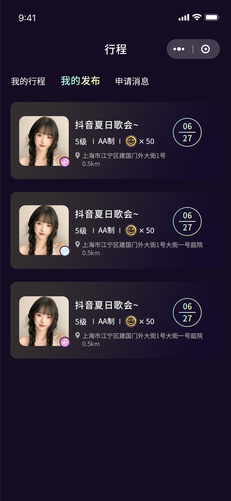
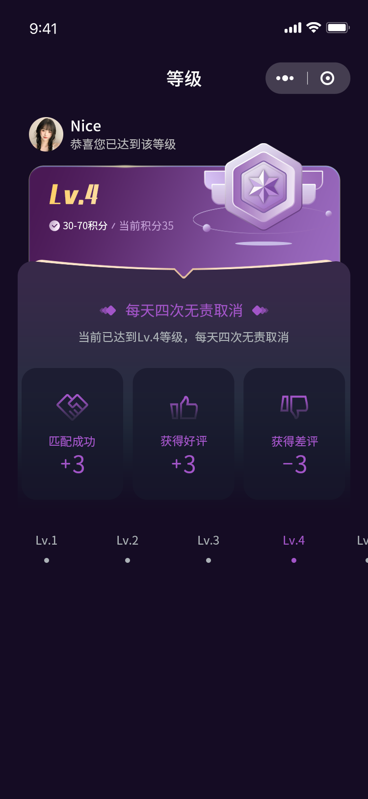
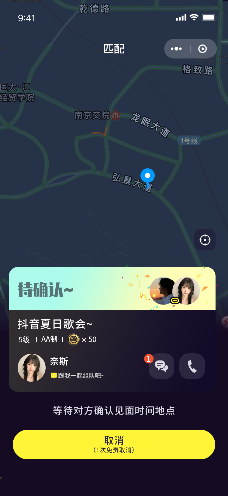
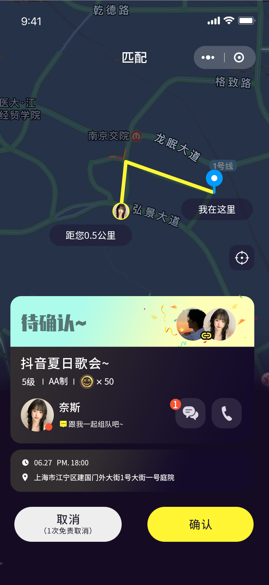
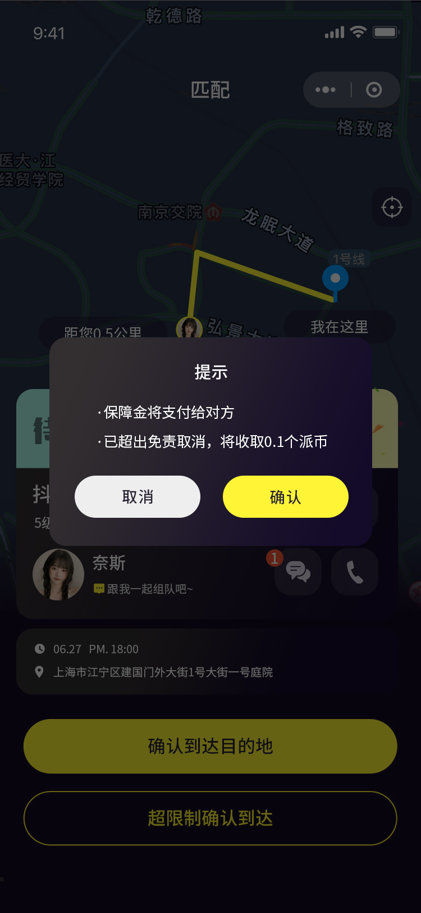
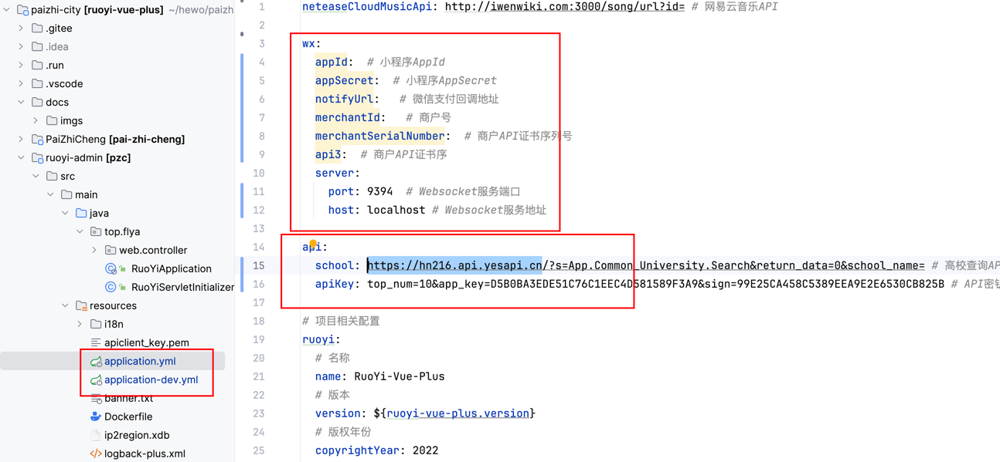
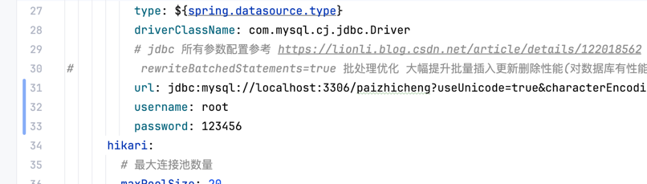
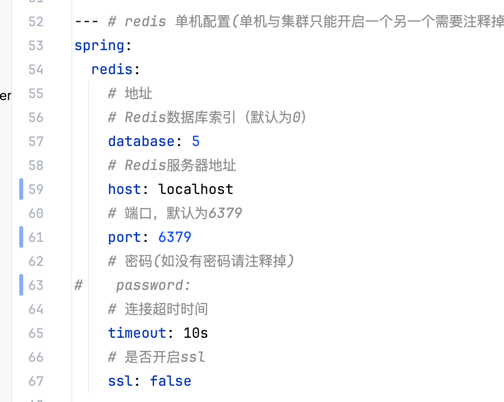
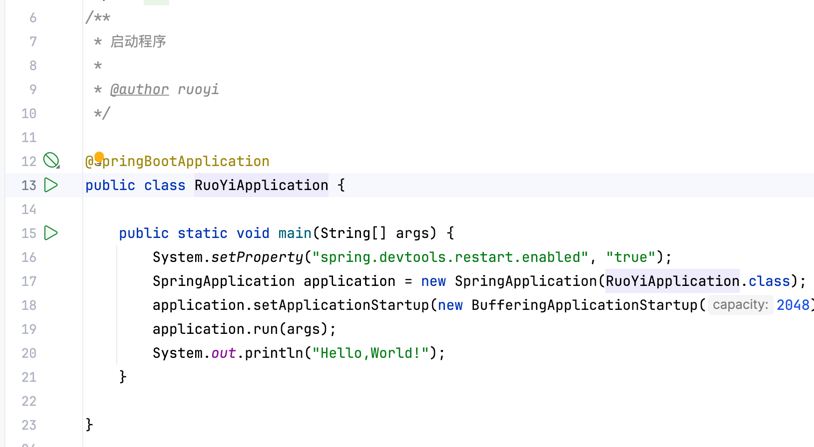

<h1 align="center">
  电音组队交友小程序-派之城
</h1>

<p align="center">
  <a href="https://github.com/fl1906/music-city/blob/master/LICENSE"></a>
  <a></a>
  <a></a>
  <a></a>
  <a></a>
  <a></a>
</p>

`派之城` 是一个微信音乐组队交友小程序，功能包括：发布音乐节活动、发布组队活动、城市组队匹配、聊天室、音乐播放、个人中心等。
它基于 [`SpringBoot`](https://spring.io/projects/spring-boot)、[`若依`](https://ruoyi.vip/)、[`Vue`](https://cn.vuejs.org/)、[`Uniapp`](https://uniapp.dcloud.io/) 实现。使用了最新的 `SpringBoot` 全家桶技术栈。使用Mysql数据库存储，通过 `SpringBoot` 提供的接口返回数据，前端使用 `Vue` 和 `Uniapp` 实现。


## 项目预览

<div>








</div>

## 在线体验


## 免责声明

本项目仅适用于学习和研究，不得用于商业使用

## 运行

后端运行：

```bash
git clone -b master --single-branch https://github.com/fl1906/music-city.git

cd music-city

```

修改配置：








小程序端运行：

打开HbuilderX，导入项目，运行到微信小程序

```bash
git clone -b uniapp --single-branch https://github.com/fl1906/music-city.git

cd music-city-uniapp

```

## 致谢
<div> 网易云音乐API ： https://binaryify.github.io/NeteaseCloudMusicApi/#/ </div>
<p></p>
<div> 高校查询接口 ： https://hn216.api.yesapi.cn/</div>
<p></p>
<div> 若依框架： https://ruoyi.vip/ </div>
<p></p>
<div>  Uniapp框架： https://uniapp.dcloud.io/ </div>
<p></p>
<div>  Satoken框架： https://sa-token.dev33.cn/ </div>


## 许可协议

[GPL](LICENSE)

## 联系作者

微信：fl1906

